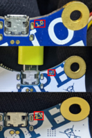

# CalliopeLinuxSetup

Bits and pieces to make Calliope mini work with Linux

Calliope mini is a micro controller used in educational settings starting in elementary school in Germany. Programming is done mostly in block languages
in web based editors. These generate Hex code, which first needs to be downloaded to a local device and then has
to be transfered via USB to the Calliope mini. For details see <https://calliope.cc/> .

Collected here are some bits and pieces to create a setup for this that streamlines the process for Linux.

## Calliope revisions

The Calliope mini micro controller has been sold in several (HW) revisons over the years. The versions differ in the
firmware running on the controller as well how the filesystem is presented to the host operating system. You can
find the version of your Calliope printed on the backside of the circuit board. Examples can be seen here



[Click here for a larger version](images/Calli_rev.png)

## Working with the Calliope Filesystem

All but revison 2.1 of the Calliope mini present one file system to the host OS. This identifies itself with the label "MINI" and has a UUID of 2702-1974. All Calliope mini controllers with these revisions I have encountered so far, show the same UUID.

Revision 2.1 exports two file systems. One again labeled "MINI" with a UUID of 0123-4567 and one labeled "FLASH" with a UUID of 089A-BCD. Given these particular UUIDs it is pretty certain, that these are universal for all Calliope mini boards of revsion 2.1.

While for first experiments it is preferable to use the mount utility for removable storage devices of your graphical desktop environment (e.g. KDE or Gnome) if frequent uploads of new code versions to the Calliope are required this quickly becomes a nuisance.

One way to streamline this is to use the autofs <https://docs.kernel.org/filesystems/autofs.html> "file system" to automatically mount the Calliope mini when it is accessed. To implement this

* Install the autofs package using the package manager of your distribution (e.g. zypper, dnf, apt)
* Create the directory where the Calliope devices will be mounted. Ensure the direcotry is owned by user/group root:root and has a protection of 755 like this

 ```bash
mzinser@discovery:~> ls -ld /calli
drwxr-xr-x 2 root root 0 Dec  9 18:56 /calli
  ```
  
* Configure autofs
  * Create an entry in /etc/auto.master to mount the Calliope mini file systems into the directory created in the previous step
  
  ```text
  /calli /etc/auto.calli --timeout=300
  ```

  * The file /etc/auto.calli should contain the following lines to cover the three file system UUIDs discussed above

  ```text
  cAm     -fstype=vfat,rw,gid=mc-user,umask=002     :/dev/disk/by-uuid/2702-1974
  cBm     -fstype=vfat,rw,gid=mc-user,umask=002     :/dev/disk/by-uuid/0123-4567
  cBf     -fstype=vfat,rw,gid=mc-user,umask=002     :/dev/disk/by-uuid/089A-BCDE
  ```

  * The group id (gid) in the example above should be a group that all users that will work with the Calliope mini on the system belong to.
  
* Configure sudo rights
  * Checking the configuration in auto.master above, one can see the `--timeout=300` entry in the configuration. This setting will cause the file system to be automatically removed after 300s (5 min). This is in general a good value for interacive use. It could be lowered to a minimum of 1s here, but even this is rather too long for the workflow with Calliope. To resolve this, the Calliope mini needs to be explicitly removed from the system, which is a prvileged operation.
  * To allow this, one assigns sudo (<https://en.wikipedia.org/wiki/Sudo>) rights to the users for this particular task
  
```text
%mc-user ALL=(ALL) NOPASSWD: /usr/bin/umount /calli/cAm, /usr/bin/umount /calli/cBm, /usr/bin/umount /calli/cBf
```

  * Put this line in a file (e.g. `mc-user`)  and copy it to `/etc/sudoers.d`. One might be tempted to shorten this to just list `/usr/bin/umount /calli/*`. This is not recommended as usage of wildcards in the command part of sudo rules is a very common source of privilege escalation problems.

## Transfer Script

Once all of this is in place files can be transfered with the [calliope.sh](ansible/files/calliope.sh) script. Things to note:

* The filename to transfer is hard coded as `MYPROG.HEX`. If you want to change this, alter the definition of `progName` at the start of the script
* This version of the script keeps a backup copy of all HEX files transfered to Calliope mini in the (hidden) direcotry `.archive_calli`. Advantage: One can revert to previous version of the (Hex) code in case subsequent changes broke a program. (Although not of the source code, this would need to be arranged in the IDE). Disadvantage: The archive directory needs to be cleaned every now and then.
* How to use
  * As this is a bash script, the obvious way to use it, is to open a terminal and execute the script in there. In this mode  output of the script will be visible, including the type of Calliope mini connected to the system, as well a reporting error conditions. If you are running into problems with the transfer, this is the recommended way to start the investigation of the root cause.
  * For users more comfortable working in a graphical desiktop environment, the script can also be executed by simply clicking on it in the file manager application (e.g. Dolphin in KDE or GNOME Files in Gnome). There will be no output in this case, which normally is fine, as you want the users to concentrate on programming the Calliope mini.

## Ansible setup playbook (optional)

If you are already familiar with [Ansible](https://www.ansible.com/) to automate system management tasks you might want to use the [playbook](ansible/calliope.yml) in the ansible subdirectory. This will

* Create the group mc-user and two users (calliuser1/2) in this group (these will work with the Calliope mini on the system) Note: The playbook creates them with a pre-set password. Either change the password before executing the playbook (instructions how to generate the new password hash are in the comments in the playbook) or change the password after the accounts have been created.
* Create the `~/Downloads` directory for these users and copy the `calliope.sh` file to this.
* Make sure autofs is installed. Note: This is currently implemented for the openSUSE Linux distribution. If you are using something else, either adapt the playbook to use the package manager of your distribution or open an issue with information on your environment.
* Create a directory where the Calliope mini file systems will be mounted
* Create a backup copiy of `/etc/auto.master`.  This will be over written on the target system in the next step. **The contents of this file on the target system should be checked before running the playbook to make sure there are no unintended side effects. The backup copy is a saftey net so one can return to the original state in case of problems**
* Copy `auto.master`, `auto.calli` and `mc-user` files with configuration settings as described above to the target system.
* Make sure the `autofs` service is running with the configuration for Calliope mini.

If you are not familiar with Ansible and have no other use cases for it, it most probably is easier to implement the changes described here manually.

## (Simple) Troubleshooting

### Calliope mini file system in "MAINTENANCE"

* In case the drive on the Calliope reports the label "MAINTENANCE" (or any of "RP2040" or "RPI2-RP2" for the revsion 2.1) the firmware on the device needs to be reinstalled. Details can be found right at the end of the FAQ: <https://calliope.cc/faq>
  (Note: The english version of the FAQ <https://calliope.cc/en/faq> is out of date and does not contain the informaton you need)
  Depending on the version of Calliope you have, you will need different images.
  * Version 1.x <https://calliope.cc/faq/calliope_mini_if_249.hex>
  * Version 2.0 <https://calliope.cc/faq/jlinkobcalliopemini_v2_230822.hex>
  * Version 2.1 <https://calliope.cc/faq/jlinkobcalliopemini_v21_230822.zip>
  * Version 3.0 <https://calliope.cc/media/pages/faq/daeddede31-1701339135/0258_nrf52820_mini3_if_crc.hex>

  For all verions but 2.1 copy the file you downloaded to the drive on the Calliope mini. For version 2.1 extract the files from the zip file you downloaded. The archive contains jlinkobcalliopemini_v21_230822.uf2. Copy this file to the drive of the Calliope.
  The update will start automatically. As part of the update process the file you copied will be removed from the Calliope drive. Afterwards the MINI (and for the revision 2.1 FLASH) drive will be visible again.

### Firmware update

Like the paragraph above, just intentional :-) To put the Calliope mini into Maintenance mode

* Disconnect the Calliope mini from power (including power via USB)
* Press the Reset Button.  [Click here for a larger version](images/Calli_reset.png)
* While holding the reset button connect the USB cable.
* Proceed as described above depending on the version of Calliope mini you have.

## Limitations

The described setup works well as long as you connect one Calliope mini at a time to your Linux computer. Since the autofs configuration uses the UUID, which is, for these particular devices, not unique, connecting more than one Calliope mini at the same time to your system will only connect to one of them.

For use in classroom/courses this should not be an issue. If you do have a practical use case to multiple Calliope minis connected at the same time, please enter an issue in this project describing the intended setup.
