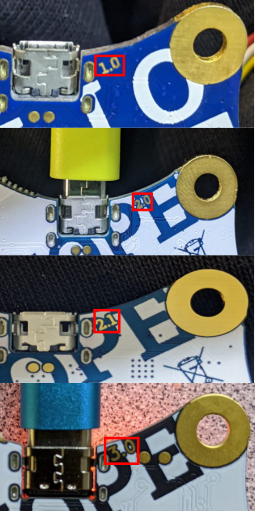

# CalliopeLinuxSetup
Bits and pieces to make Calliope work with Linux

Calliope is a micro controller used in school settings in Germany. Programming is done mostly in block languages 
in web based editors. These generate Hex code, which first needs to be downloaded to a local device and then has 
to be transfered via USB to the Calliope. For details see https://calliope.cc/ .

Collected here are some bits and pieces to create a setup for this that streamlines this process for Linux. 

(Simple) Troubleshooting:
- In case the drive on the Calliope reports the label "MAINTENANCE" (or any of "RP2040" or "RPI2-RP2" for the revsion 2.1) the firmware on the device needs to be reinstalled. Details can be found right at the end of the FAQ: https://calliope.cc/faq
  (Note: The english version of the FAQ https://calliope.cc/en/faq is out of date and does not contain the informaton you need)
  Depending on the version of Calliope you have, you will need different images.
  - Version 1.x https://calliope.cc/faq/calliope_mini_if_249.hex
  - Version 2.0 https://calliope.cc/faq/jlinkobcalliopemini_v2_230822.hex
  - Version 2.1 https://calliope.cc/faq/jlinkobcalliopemini_v21_230822.zip
    
  For versions 1.x and 2.0 copy the file you downloaded to the drive on the Calliope. For version 2.1 extract the files from the zip file you downloaded. The archive contains jlinkobcalliopemini_v21_230822.uf2. Copy this file to the drive of the Calliope.
  The update will start automatically. As part of the update process the file you copied will be removed from the Calliope drive. Afterwards the MINI (and for the revision 2.1 FLASH) drive will be visible again.
