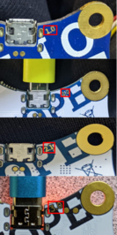

# CalliopeLinuxSetup

Bits and pieces to make Calliope mini work with Linux

Calliope mini is a micro controller used in school settings in Germany. Programming is done mostly in block languages
in web based editors. These generate Hex code, which first needs to be downloaded to a local device and then has
to be transfered via USB to the Calliope mini. For details see <https://calliope.cc/> .


Collected here are some bits and pieces to create a setup for this that streamlines the process for Linux.

## Calliope revisions

The Calliope mini micro controller has been sold in several (HW) revisons over the years. The versions differ in the
firmware running on the controller as well how the filesystem is presented to the host operating system. You can
find the version of your Calliope printed on the backside of the circuit board. Examples can be seen here (click
for a larger version):



## Working with the Calliope Filesystem

Up to and including revision 2.0, Calliope mini presents one file system to the host OS. This identifies itself with the label "MINI" and has a UUID of 2702-1974. All Calliope mini controllers with these revisions I have encountered so far, show the same UUID.

Revision 2.1 exports two file systems. One again labeled "MINI" with a UUID of 0123-4567 and one labeled "FLASH" with a UUID of 089A-BCD. Given these particular UUIDs it is pretty certain, that these are universal for all Calliope mini boards of revsion 2.1.

While for first experiments it is preferable to use the mount utility for removable storage devices of your graphical desktop environment (e.g. KDE or Gnome) if frequent uploads of new code versions to the Calliope are required this quickly becomes a nuisance.

One way to streamline this is to use the autofs <https://docs.kernel.org/filesystems/autofs.html> "file system" to automatically mount the Calliope when it is accessed. To implement this

* Install the autofs package using the package manager of your distribution (e.g. zypper, dnf, apt)
* Create the directory where the Calliope devices will be mounted. Ensure the direcotry is owned by user/group root:root and has a protection of 755 like this

 ```bash
mzinser@discovery:~> ls -ld /calli
drwxr-xr-x 2 root root 0 Dec  9 18:56 /calli
  ```
  
* Configure autofs
  * Create an entry in /etc/auto.master to mount the Calliope mini file systems into the directory created in the previous step
  
  ```text
  /calli /etc/auto.calli --timeout=300
  ```

  * The file /etc/auto.calli should contain the following lines to cover the three file system UUIDs discussed above

  ```text
  cAm     -fstype=vfat,rw,gid=calliuser,umask=002     :/dev/disk/by-uuid/2702-1974
  cBm     -fstype=vfat,rw,gid=calliuser,umask=002     :/dev/disk/by-uuid/0123-4567
  cBf     -fstype=vfat,rw,gid=calliuser,umask=002     :/dev/disk/by-uuid/089A-BCDE
  ```

  * The group id (gid) in the example above should be a group that all users that will work with the Calliope mini on the system.
  
* Configure sudo rights
  * Checking the configuration in auto.master above, one can see the `--timeout=300` entry in the configuration. This setting will cause the file system to be automatically removed after 300s (5 min). This is in general a good value for interacive use This could be lowered to a minimum of 1s here, but even this is rather too long for the workflow with Calliope. To resolve this, the Calliope mini needs to be explizitly removed from the system, which is a prvileged operation. 
  * To allow this, one assigns sudo (<https://en.wikipedia.org/wiki/Sudo>) rights to the users for this particular task
  
```text
%calliuser ALL=(ALL) NOPASSWD: /usr/bin/umount /calli/cAm, /usr/bin/umount /calli/cBm, /usr/bin/umount /calli/cBf
  ```

  * This line should be added to `/etc/sudoers`. One might be tempted to shorten this to just list `/usr/bin/umount /calli/*`. This is not recommended as usage of wildcards in the command part of sudo rules is a very common source of privilege escalation problems.

## Transfer Script

Once all of this is in place files can be transfered with the [calliope.sh](calliope.sh) script. Things to note:

* The filename to transfer is hard coded as `MYPROG.HEX`. If you want to change this, alter the definition of `progName` at the start of the script
* This version of the script keeps a backup copy of all HEX files transfered to Calliope mini in the (hidden) direcotry `.archive_calli`. Advantage: One can revert to previous version of the (Hex) code in case subsequent changes broke a program. (Although )

## (Simple) Troubleshooting

* In case the drive on the Calliope reports the label "MAINTENANCE" (or any of "RP2040" or "RPI2-RP2" for the revsion 2.1) the firmware on the device needs to be reinstalled. Details can be found right at the end of the FAQ: <https://calliope.cc/faq>
  (Note: The english version of the FAQ <https://calliope.cc/en/faq> is out of date and does not contain the informaton you need)
  Depending on the version of Calliope you have, you will need different images.
  * Version 1.x <https://calliope.cc/faq/calliope_mini_if_249.hex>
  * Version 2.0 <https://calliope.cc/faq/jlinkobcalliopemini_v2_230822.hex>
  * Version 2.1 <https://calliope.cc/faq/jlinkobcalliopemini_v21_230822.zip>

  For versions 1.x and 2.0 copy the file you downloaded to the drive on the Calliope. For version 2.1 extract the files from the zip file you downloaded. The archive contains jlinkobcalliopemini_v21_230822.uf2. Copy this file to the drive of the Calliope.
  The update will start automatically. As part of the update process the file you copied will be removed from the Calliope drive. Afterwards the MINI (and for the revision 2.1 FLASH) drive will be visible again.
